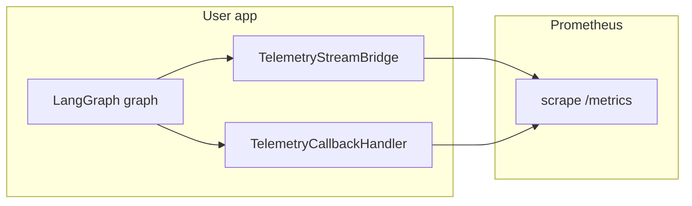

# Architecture

- **TelemetryStreamBridge** wraps `graph.stream` / `graph.astream` with `version="v2"` and records node timings and run counters.
- **TelemetryCallbackHandler** attaches to LangChain’s callback system and records LLM token counters from `on_llm_end`.
- Share one **`TelemetryMetricSet`** via `build_telemetry(...)` when using both to avoid duplicate Prometheus registrations on the same registry.

See the repository `README.md` for a minimal code sample.
